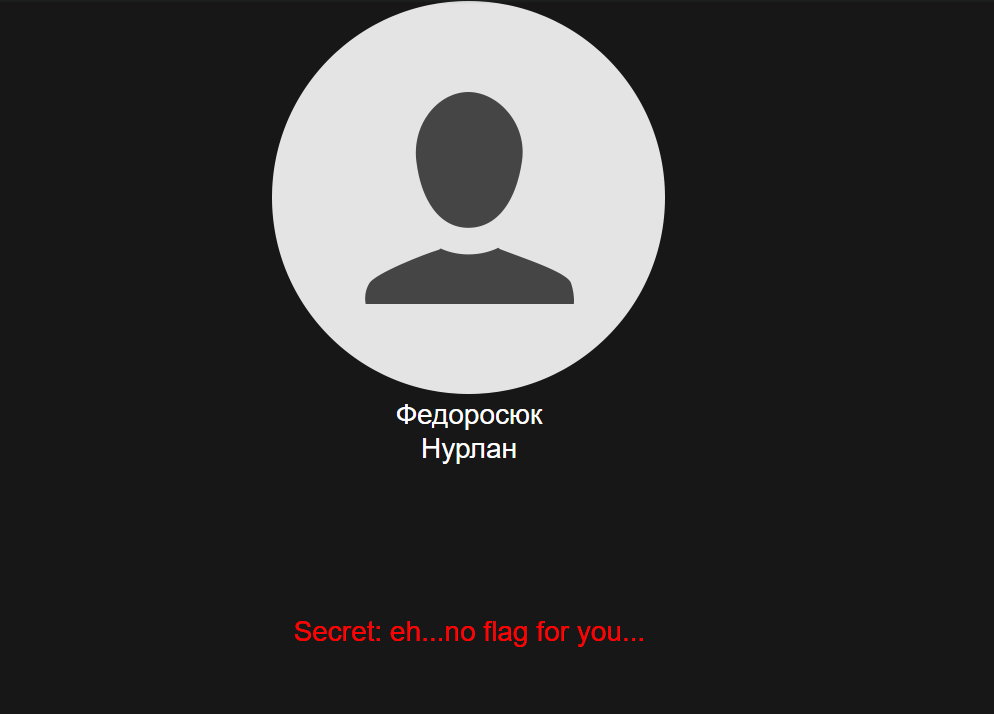
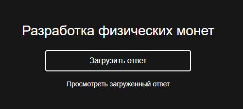
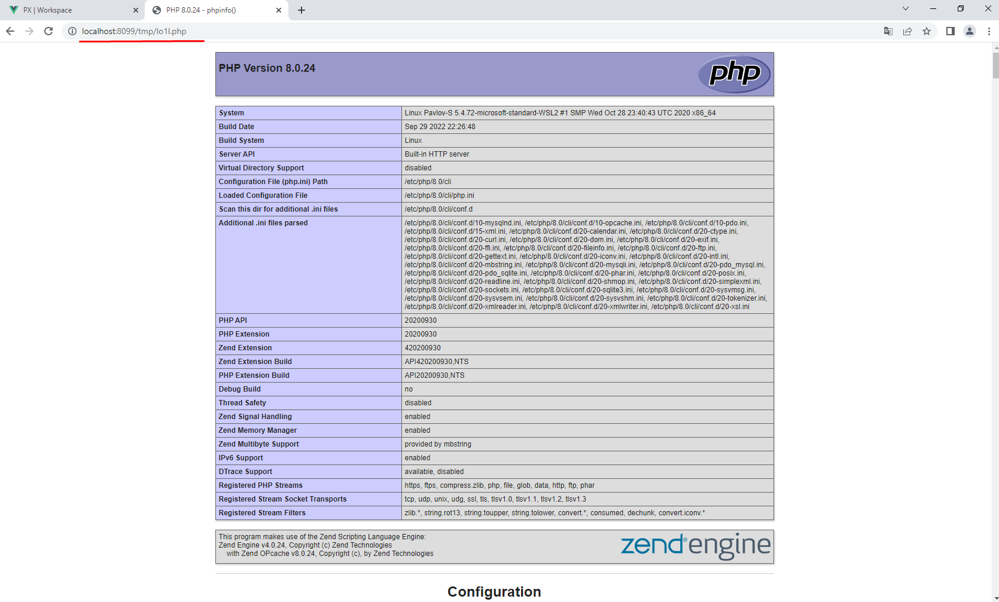

# SSB
## WEB

## Описание:  
У каждой команды есть приватные данные - это непубличные данные о пользователе.  
Задача атакующих найти доступ к этим данным:

    

Пример флага

## Решение:
### Приватный флаг:  
Для получения доступа к флагу необходимо найти шелл. Найти его не трудно, нужно загрузить его в любое задание и понять, что отдача файлов веб-сервером настроена не правильно.  
Пример шелла:  

    <?PHP 

    phpinfo();

    ?>

   

Загружаем шелл

  

Результат
 

Далее как вариант скачать базу данных (т.к. это SQLite, то бд представлена в виде файла) и уже оттуда начать переть флаги.

# TODO:
 - Удаление устаревших данных

> Flag format: `<NOT_YET>`